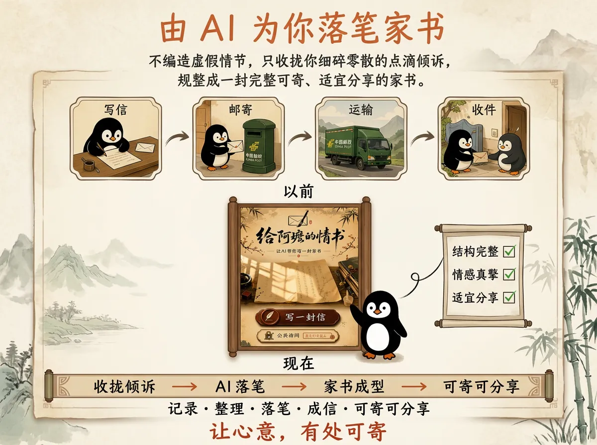
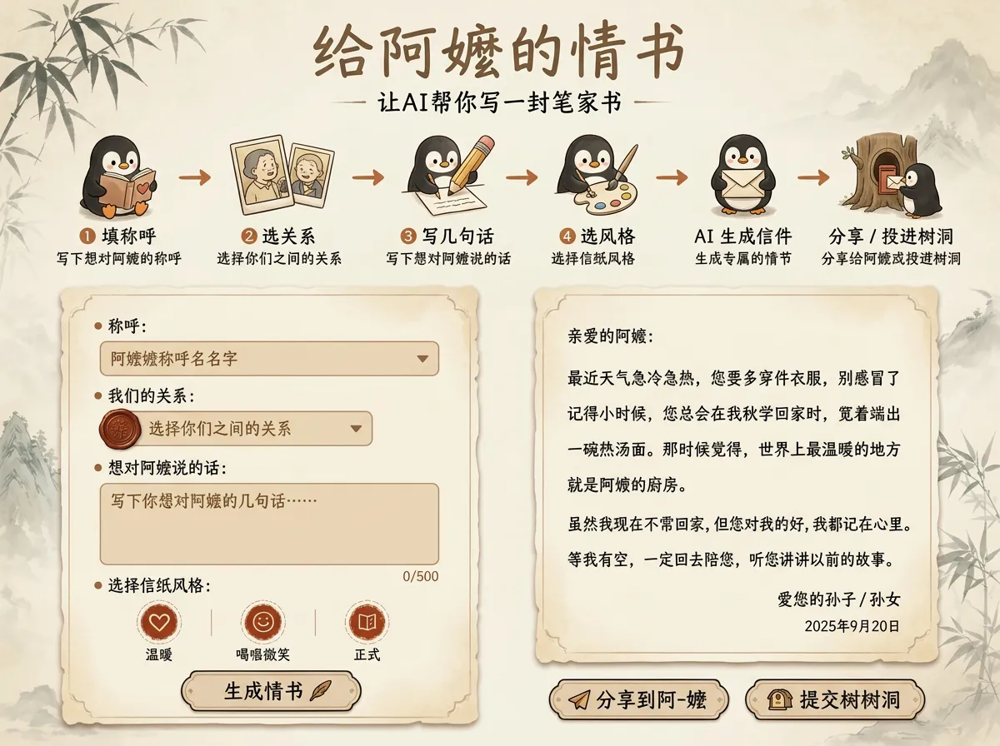
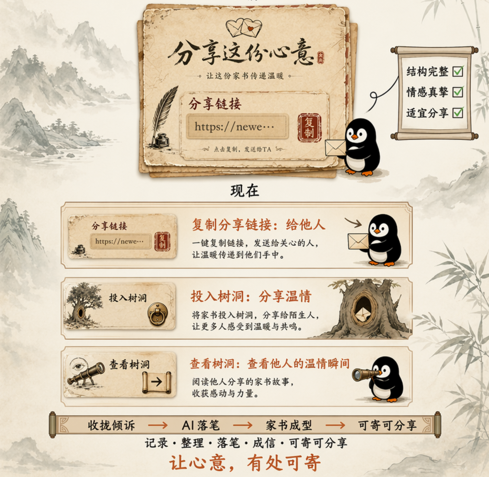
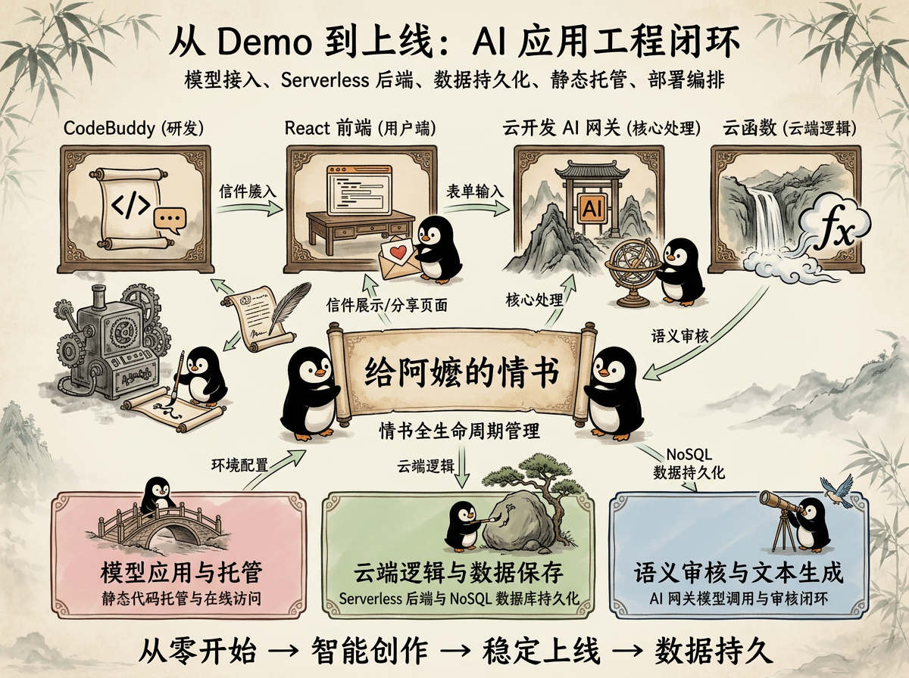
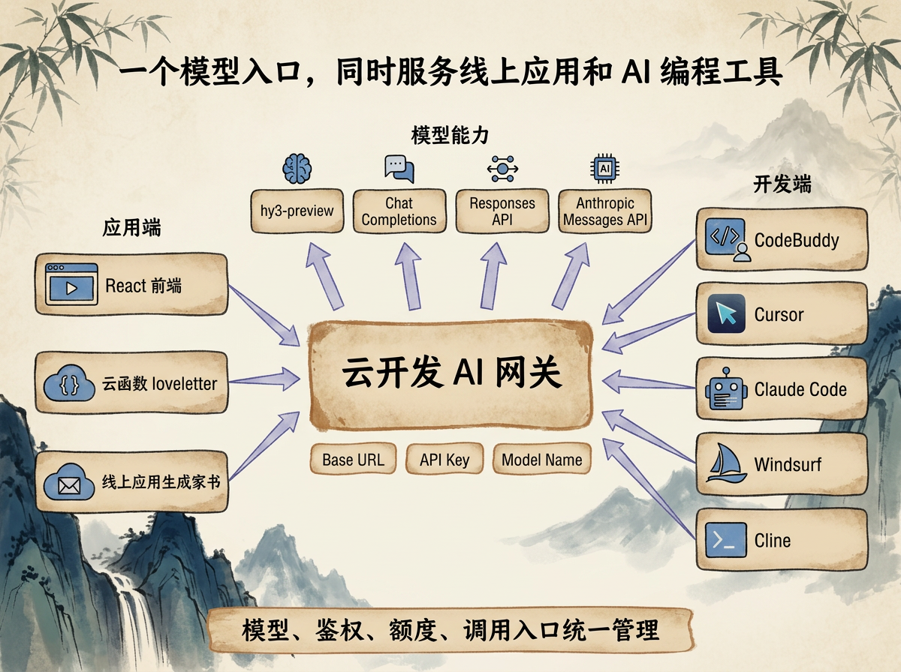
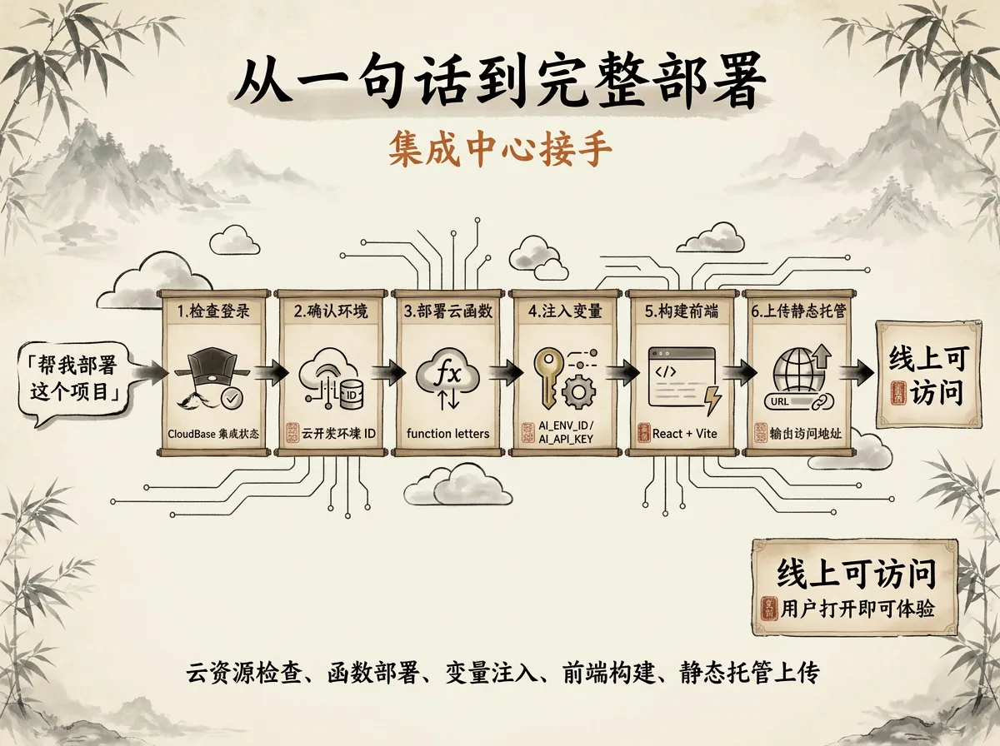

# 给阿嬷一封来自云端的信（上）

> AI 替你写一封给阿嬷的家书。这个项目从模型调用、云函数、数据库、静态托管到一键部署，都基于云开发和使用 CodeBuddy
> 接入云开发大模型开发完成。
>
在线体验：[https://newenv-4gnsku1ra42bb737-1308771514.tcloudbaseapp.com/](https://newenv-4gnsku1ra42bb737-1308771514.tcloudbaseapp.com/)

---

## 一、爱在心口口难开

二刷《给阿嬷的情书》，依旧眼泪汪汪，推荐大家去看！

电影里，谢南枝替人写了一辈子侨批。那些来找她的同乡，并不是没有话说，只是不知道怎么把心里话落到纸上。

隔着山海，隔着谋生的日子，隔着一张薄薄的信纸，一句“我想你”常常要绕很远，才敢写出来。

云开发团队做了一个小应用，叫「给阿嬷的情书」。

由 AI 为你落笔家书，不编造虚假情节，只收拢你细碎零散的点滴倾诉，规整成一封完整可寄、适宜分享的家书。



---

## 二、产品闭环

产品流程：填称呼、选关系、写几句话、选风格，AI 生成后可分享或投递树洞。
生成后的信以旧信纸形式展示，而非直接弹出 AI 文本。这个设计让生成结果更接近收信体验。



用户输入往往只有几句零散的话：

> 阿嬷，我很久没回家了。小时候你总在巷口等我放学，给我做橄榄菜配白粥。我现在工作很忙，但很想你。

AI 生成的目标不是模板化地写一句“亲爱的阿嬷我非常想念您”，而是围绕用户提供的真实细节展开：

> 阿嬷，见字如面。
>
> 近来天热，不知你胃口可还好。
>
> 我常想起小时候放学，远远看见你站在巷口，手里像总有一碗白粥等我。那时候只觉得橄榄菜香，如今才知道，原来那是有人惦记的味道。
>
> 我在外头一切都好，只是忙起来时，总觉得日子过得太快，快到连一句想你都常常忘了说。
>
> 阿嬷，等我回去，再陪你吃一碗白粥。

写信完成之后，即可到分享页面，将信件分享给他人、或者投递到公共树洞



---

## 三、从产品搭建到产品上线，真正的问题在后端

「给阿嬷的情书」看起来只是一个超轻量级网页应用，但从产品搭建到产品上线，不可避免地面临以下工程问题：

- **模型调用**：前端不能直接暴露模型 Key，需要服务端代理。
- **Prompt 编排**：不同关系、不同风格、不同输入内容，需要在服务端统一拼装请求。
- **结构化输出**：模型返回内容需要可解析，不能只返回一段自然语言。
- **数据持久化**：生成后的信件需要入库，才能被分享页和树洞再次读取。
- **访问链路**：分享链接需要根据 `id` 还原完整信件。
- **内容安全**：开放输入需要处理不合适的称呼和表达。
- **部署编排**：云函数、环境变量、前端构建、静态托管需要一次性部署到位。

如果拆分能力独立搭建，项目会离散为：模型 API、Node 服务、数据库、对象存储、静态托管、CI/CD、环境变量管理等多个模块，运维复杂。
本项目采用云开发一体化建设，全链路收口统一实现：

- **云函数**负责服务端逻辑，包括模型调用、Prompt 编排和返回解析。
- **云开发 AI 网关**负责接入大模型。
- **NoSQL 数据库**负责保存每一封生成后的信。
- **静态托管**负责承载 React 前端。
- **CodeBuddy**负责把开发、调试、部署串起来。

它表面上是一个"写信"应用，实际跑通的是一个完整的 AI 应用工程闭环。



---

## 四、云开发的重点：应用能调，AI 工具也能接

很多人对云开发的印象还停留在“小程序后端”：云函数、数据库、文件存储。

但在 AI 应用开发里，云开发更关键的价值，是把模型能力也纳入同一个开发环境。

在这个项目中，`loveletter` 云函数通过云开发 AI 网关调用 `hy3-preview` 模型生成信件正文。云开发 AI
网关兼容[主流 AI 协议](https://docs.cloudbase.net/ai/ai-tools/protocol)，调用方式接近常见的大模型 API：配置 Base URL、API
Key、Model Name 即可请求。

更关键的是，这个模型入口不只给线上应用调用，也可以给 AI 编程工具使用。

云开发 AI 网关支持多种[主流协议](https://docs.cloudbase.net/ai/ai-tools/protocol)：

| 协议                     | 适合场景                       |
|------------------------|----------------------------|
| Chat Completions       | OpenAI 兼容，适合大多数文本生成场景      |
| Responses API          | OpenAI 新一代接口，适合更复杂的状态管理    |
| Anthropic Messages API | Claude 原生协议，适合 Claude 生态工具 |

这意味着，除了应用里的云函数可以调模型，许多支持自定义模型端点的 AI 编程工具也可以接入云开发模型，比如
CodeBuddy、Cursor、Claude Code、Windsurf、Cline 等。

配置通常只需要三个值：

```text
Base URL : https://{环境ID}.api.tcloudbasegateway.com/v1/ai/cloudbase
API Key  : 云开发 AI 网关 Key
Model    : hy3-preview
```

也就是说，同一个云开发模型入口，可以同时服务两端：

- **应用端**：云函数调用模型，生成家书。
- **开发端**：AI 编程工具调用模型，辅助写代码、改代码、理解项目。

对个人开发者和小团队来说，这一点有实际价值。模型、鉴权、额度、调用入口可以统一放在云开发侧管理，不需要应用运行时和 AI IDE
各自维护一套模型资源。



---

## 五、核心云函数：用服务端代理模型调用

项目的核心云函数是 `loveletter`。它接收前端传来的 `to`、`relation`、`words`、`style`，在服务端完成 Prompt 编排，然后请求云开发
AI 网关。

核心调用逻辑如下：

```js
const ENV_ID = process.env.TCB_ENV || process.env.SCF_NAMESPACE;
const AI_ENV_ID = process.env.AI_ENV_ID || ENV_ID;
const AI_BASE_URL = `https://${AI_ENV_ID}.api.tcloudbasegateway.com/v1/ai/cloudbase`;
const AI_API_KEY = process.env.AI_API_KEY;
const MODEL = 'hy3-preview';

async function generateLetter(messages) {
    const resp = await fetch(`${AI_BASE_URL}/chat/completions`, {
        method: 'POST',
        headers: {
            'Content-Type': 'application/json',
            Authorization: `Bearer ${AI_API_KEY}`,
        },
        body: JSON.stringify({
            model: MODEL,
            messages,
            temperature: 0.8,
            max_tokens: 2000,
        }),
    });

    if (!resp.ok) {
        const text = await resp.text();
        throw new Error(`AI 网关返回 ${resp.status}: ${text}`);
    }

    const data = await resp.json();
    return data.choices?.[0]?.message?.content?.trim() || '';
}
```

这段代码的关键不在于调用本身，而在于服务端代理带来的工程收益：

- `AI_API_KEY` 放在云函数环境变量中，不暴露到浏览器侧。
- 前端只调用云函数，不直接请求模型网关。
- Prompt 编排、结构化输出解析、内容审核都可以在服务端统一处理。
- 模型生成结果可以直接写入云开发 NoSQL。
- 数据库返回的 `_id` 可以作为分享页和读信页的唯一入口。

前端调用保持轻量：

```js
const res = await cloudbase.callFunction({
    name: 'loveletter',
    data: {to, relation, words, style},
});

const result = res.result;
const data = typeof result.body === 'string' ? JSON.parse(result.body) : result;
if (!data.ok) throw new Error(data.error || '生成失败');
```

用户看到的是一封信；技术实现上，是云函数、AI 网关、数据库和前端路由之间的一次完整协作。

---

## 六、CodeBuddy 一句话部署：把上线流程编排掉

单说"AI 写代码"，主流工具已很常见。

这个项目更值得关注的是：CodeBuddy 和云开发集成后，不只参与编码，还能参与云资源部署。

传统部署流程通常包括：

1. 打开云开发控制台。
2. 确认环境 ID 和 Access Key。
3. 配置 AI 网关 API Key。
4. 构建 React 前端。
5. 部署 5 个云函数。
6. 给 `loveletter` 设置环境变量和超时时间。
7. 上传 `dist/` 到静态托管。
8. 获取线上访问地址。

这些步骤单独看都不复杂，但组合起来就是部署编排问题。尤其是 AI 应用里，模型 Key、云函数超时、前端环境变量、静态托管路径都容易遗漏。

在 CodeBuddy 中，可以直接说：

> 帮我部署这个项目。

它会根据项目结构和部署说明执行：

- 检查 CloudBase 集成是否已登录。
- 确认当前云开发环境。
- 读取 `.env`，核对前端和 AI 相关变量。
- 部署 5 个云函数：`loveletter`、`getletter`、`listletters`、`countletters`、`publishletter`。
- 给 `loveletter` 注入 `AI_ENV_ID` 和 `AI_API_KEY`。
- 构建 React + Vite 前端。
- 上传 `dist/` 到静态托管。
- 输出线上访问地址。

这把 AI 在开发流程中的作用往前推了一步。它把云资源检查、函数部署、变量注入、前端构建、静态托管上传纳入同一个开发工作流。

一句话总结：

> 云开发把 AI 应用需要的后端能力收在一起，CodeBuddy 再把这些能力接入开发与部署流程。



---

## 七、Prompt 约束：信好不好，还得靠产品规则

模型、后端和部署跑通之后，信写得好不好，仍然取决于 Prompt 设计。

这个项目不希望生成“标准、空泛、煽情”的 AI 作文，因此在 `loveletter` 中对风格做了明确约束：

```js
const STYLE_HINT = {
    warm:
        '基调：温情家书。' +
        '语言质朴克制，不堆砌形容词，用具体的生活细节代替空泛抒情。' +
        '比如写"前日晚饭烤番薯，三个孩童吃得欢喜"，而不是"我非常想念你"。' +
        '句式偏短，口语化但不粗糙，带一点文言的温润感。' +
        '每段只写一件小事或一个牵挂，段与段之间留白。',
};
```

这里最重要的不是“写得感人”，而是把产品希望呈现的内容质感拆成可执行规则：

- 忠于用户输入，不凭空编造。
- 用生活细节代替抽象抒情。
- 句子短一点，留白多一点。
- 可以润色，但不要把别人的回忆写假。
- 不让模型自由发挥到偏离产品定位。

Prompt 不是许愿池，而是产品规则的一部分。前端负责交互体验，云函数负责服务端编排，Prompt 则负责定义生成内容的边界。

---

## 八、小结

这个小应用能快速落地，不是因为要自己搭后端，而是因为云开发把 AI 应用常见的后端工作收敛到同一个环境里。

它用云函数承载生成逻辑，用 NoSQL 保存信件，用静态托管承载前端，用 AI 网关调用模型。更进一步，云开发 AI 网关还可以接入多种 AI
编程工具；开发时用的模型和线上应用调的模型，可以来自同一个云开发模型入口。

而 CodeBuddy 解决的是另一段距离：从“代码写好了”到“项目上线了”。

对这个项目来说，真正值得展开的命题不是"AI 可以写信"，而是：

> AI 应用开发不是只多了一个模型接口，而是模型接入、Serverless 后端、数据持久化、静态托管和部署编排被重新放到了一条链路里。

上篇先到这里。

下篇继续讲更细的工程问题：结构化输出如何保证稳定解析，AI 语义审核如何替代简单黑名单，以及 CodeBuddy 一句话部署背后的工程化流程。

