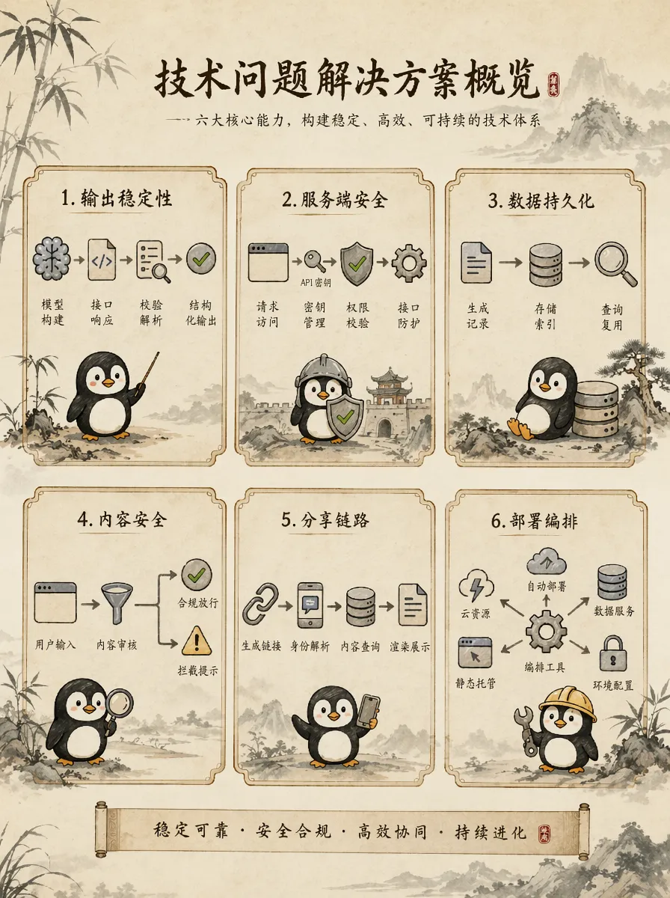
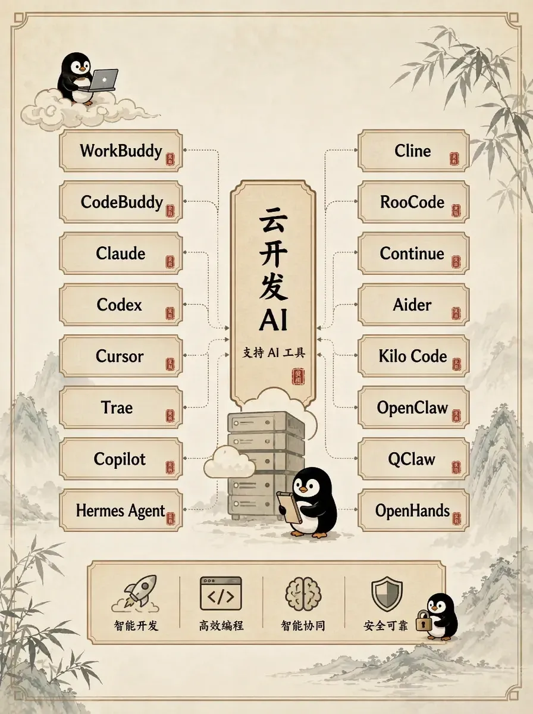

# 给阿嬷一封来自云端的信（下）

> 上篇讲了「给阿嬷的情书」如何用云开发从创意变成可访问的 AI 应用。
> 
> 本篇继续拆解工程化实现细节：结构化输出、服务端代理、数据持久化、内容安全、AI 网关，以及通过 AI 工具以一条指令完成部署。

## 一、工程能力完善

AI Demo 到可上线产品，还需要具备完整的工程化实现。

「给阿嬷的情书」这个应用，从产品搭建到产品上线，不可避免地面临以下问题：



- **输出稳定性**：模型返回内容是否可被程序稳定解析？
- **服务端安全**：模型 Key 如何托管，避免暴露在浏览器侧？
- **数据持久化**：生成后的信件如何入库，方便二次读取和分享？
- **内容安全**：开放输入下，如何处理不合适的称呼和表达？
- **分享链路**：分享链接打开后，如何根据 `id` 还原完整信件？
- **部署编排**：云函数、数据库、静态托管、环境变量如何一次性部署到位？

本篇文章聚焦本项目的工程实现：结构化输出、云开发后端、语义审核、Prompt 约束、AI 网关，以及 AI 工具的生态配合。

## 二、模型输出治理与语义审核

模型输出如果是自由文本，后续展示、入库、分享都会依赖脆弱的字符串解析。因此调用大模型时，Prompt 要求大模型返回固定 JSON 结构：`{"to":"审核后的收件人称呼","letter":"信件正文"}`。

`to` 用于信件标题展示，`letter` 用于信件内容。云函数拿到 JSON 后按字段执行后续流程。

Prompt 里直接声明输出格式，同时把称呼审核也合并到同一次调用里 Prompt 是具体的产品规则：

- **明确角色定位**：你是替人代笔的谢南枝，不是"AI 助手"。
- **明确能力边界**：可以围绕用户说过的事展开，但不要另起炉灶编新故事。
- **明确风格约束**：不用"请写得温暖感人"，而是给具体写法——用生活细节代替抽象抒情，句子偏短，一段只写一件事，结尾点到即止。
- **明确审核规则**：称呼不合适时按关系替换；输入含不当内容时只保留合理表达；结合关系、语义和上下文判断，不凭单一词决策。

项目生成信件的 Prompt 结构如下（已浓缩）：

```text
system:
你是电影《给阿嬷的情书》里替人代笔的谢南枝，
一辈子写侨批家书，知道最动人的信不靠华丽辞藻，
而是把日常小事写得让人鼻子一酸。

【输出格式——严格 JSON】
必须输出纯 JSON，不要 markdown 代码块，不要解释。
格式：{"to":"审核后的收件人称呼","letter":"信件正文"}

to 字段规则：
- 如果用户填的称呼正常（如"阿嬷""妈妈"），原样保留；
- 如果不合适，按关系替换为合理称呼（如"孙子"关系用"阿嬷"）。

letter 字段规则：
第一行写称呼（如"阿嬷，见字如面。"），
段落之间用 

 分隔，不要署名。

user:
请替我给「阿嬷」写一封信。
· 我与 TA 的关系：祖孙
· 我想对 TA 说的话：
  小时候你总在巷口等我放学，给我做橄榄菜配白粥。
  我现在工作很忙，但很想你。
请严格按 JSON 格式输出 {"to":"...","letter":"..."}。
```

只在 Prompt 里声明"严格 JSON"并不够。大模型输出具有随机性，可能返回不合法 JSON。

因此云函数必须做容错解析：首先尝试解析 JSON，如果失败，把整段当作信件正文，收件人用用户原始输入。

> 模型输出可以有波动，但页面渲染、数据库写入和分享流程不能因此中断。

示意（同一段 Prompt 里完成审核与生成）：

| 用户输入 | 模型实际输出 | 说明 |
|----------|-------------|------|
| `to="傻X"`，`relation="孙子"` | `to="阿嬷"` | 不合适称呼按关系替换为合理值 |
| `to="阿嬷"`，`words` 含不当内容 | `letter` 只保留亲情表达，忽略不当部分 | 按关系判断，不凭单一词决策 |
| `to="爱人"`，`words` 含情话 | `letter` 正常润色 | 夫妻关系下情话是正常表达 |

审核和解析逻辑均运行在云函数内，和生成共用同一次模型调用，不需要额外搭建服务。

## 三、Serverless 后端：把基础设施问题交给云开发

前文聚焦模型输出治理。但一个 AI 应用真正上线，还需要完整的服务端运行环境。

「给阿嬷的情书」没有单独维护传统后端服务，而是用云开发把工程能力收敛到同一个环境里：

| 工程需求 | 云开发里的实现 |
|----------|------------------|
| 模型调用 | 云开发 AI 网关 + `loveletter` 云函数 |
| 服务端代理 | 云函数封装 Prompt、鉴权和解析逻辑 |
| 数据持久化 | 云开发 NoSQL `letters` 集合 |
| 分享页读取 | `getletter` 云函数按 `id` 查询 |
| 公共树洞列表 | `listletters` / `countletters` 云函数分页与统计 |
| 公开状态管理 | `publishletter` 云函数更新 `public` 字段 |
| 前端访问 | 静态托管承载 React 构建产物 |
| 密钥安全 | 云函数环境变量托管 `AI_API_KEY` |

这样做带来以下工程收益：

**不需要单独申请云服务器。** 云函数按请求触发，空闲时不产生费用，也不需要维护运行环境。对于访问量不高、请求突发的个人项目或小产品，这比固定规格的云服务器更合适。

**不需要单独申请数据库服务。** 云开发 NoSQL 数据库随环境开通，不需要建库、建表、配网络。数据读写通过云函数完成，天然隔离了直接暴露数据库端口的风险。

**不需要单独找静态托管服务。** 前端构建产物直接上传到云开发静态托管，和云函数、数据库在同一个环境里，域名、证书、CDN 不需要单独配置。

**模型 Key 不需要写在前端代码里。** 统一放在云函数环境变量中，前端只负责调用云函数，不直接接触任何密钥。

综上，云开发解决的核心问题是：**把模型接入、Serverless 运行时、数据存储、静态托管和密钥管理收敛到同一个环境，不需要跨平台拼装。** 过去要分别申请、分别配置、分别维护的几件事，现在在同一个项目里完成。


它不是只提供一个"能调模型"的接口，而是提供了一套 AI 应用后端底座：模型网关、Serverless 运行时、数据存储、静态托管和环境变量管理都在同一个开发环境里。

## 四、云开发 AI 网关：不只是"调一个模型"

云开发 AI 网关在本项目中承担了三种角色：文本生成、语义审核、结构化输出控制。

更重要的是，它是一个统一的模型访问层。后续如果要增加图像生成、翻译、摘要、标签生成等 AI 能力，都可以沿着同一个网关入口扩展。

它不只给线上应用调用，还支持[主流 AI 协议](https://docs.cloudbase.net/ai/ai-tools/protocol)，Cursor、Claude Code、Codex、Trae、Cline 等工具只需配置 Base URL 和 API Key 即可接入。

其中 **CodeBuddy 原生集成了云开发**，开箱即用，可以直接部署云资源。

模型、鉴权、额度、调用入口统一放在云开发侧管理，不需要应用运行时和 AI IDE 各自维护一套模型资源。




## 五、CodeBuddy 一条指令部署：原生集成云开发，内置部署 skill

CodeBuddy 原生集成了云开发，开箱即用。一键部署依赖内置的云开发部署 skill：它把云资源检查、函数部署、变量注入、前端构建、静态托管上传按一个清单跑完。

项目包括 5 个云函数、React + Vite 前端、NoSQL 数据库。人工部署每次都要处理重复但容易遗漏的配置。

在 CodeBuddy 中直接说：

> 帮我部署本项目。

它会执行：检查云开发环境、部署云函数、注入环境变量、构建前端、上传静态托管、输出访问地址。

Agent 负责执行重复步骤，开发者负责关键决策、审核环境、确认配置和判断结果。

> 云开发把 AI 应用需要的后端能力收在一起，CodeBuddy 再把这些能力接入开发与部署流程。

除了 CodeBuddy，云开发 AI 网关也支持接入 Cursor、Claude Code、Codex、Trae、Cline 等多种 AI 编程工具（[查看完整列表](https://docs.cloudbase.net/ai/ai-tools/protocol)），配置 Base URL 和 API Key 即可使用。


## 六、冰山之下：云开发的价值

「给阿嬷的情书」功能单一，但覆盖了 AI 应用常见的几个关键模块：模型调用、后端逻辑、数据存储、前端上线、AI 工具接入、部署编排。

过去这些能力分散在不同平台：模型 API 单独申请，服务端单独搭建，数据库单独配置，静态托管单独找服务，AI 工具单独接入，部署命令手动执行。

云开发把这些环节收敛到同一个环境：

- 模型调用通过 AI 网关统一入口
- 后端逻辑运行在云函数，不需要维护服务器
- 数据存在云开发 NoSQL，随环境开通
- 前端构建产物直接上传静态托管
- AI 编程工具通过 AI 网关协议接入，不需要单独申请模型额度
- 部署通过 CodeBuddy 通过一条指令完成，不需要手动跑命令

这一方案的优势在于：轻量，不需要分别申请和配置；完整，覆盖 AI 应用从开发到上线的完整链路；可扩展，云函数、数据库、静态托管、AI 网关在同一个环境里，后续增加能力不需要迁移。

这才是云开发在 AI 应用里核心价值： 它不是帮你省掉某一个 API，而是把模型接入、Serverless 后端、数据持久化、静态托管、部署编排和 AI 编程工具整合到同一个项目流程里。

在线体验地址：[https://newenv-4gnsku1ra42bb737-1308771514.tcloudbaseapp.com/](https://newenv-4gnsku1ra42bb737-1308771514.tcloudbaseapp.com/)
